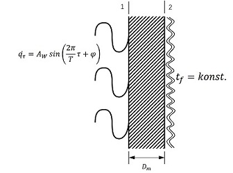

# Numerical solution of 1-D heat conduction

## 问题叙述

无限大平壁左侧均匀给定周期性变化的热流波 qτ，右侧给定外侧流体温度恒为 tf。这时左侧面将产生周期性变化的温度波，此温度波与左侧面给定的热流波之间将产生一个相位差 ϕ。

探究此相位差 ϕ 与平板右侧与流体间的对流换热系数 α 间的关系，并对比不同壁厚和材料对关系曲线走势的影响，并给出通过实验测定该相位差从而间接测定对流换热系数的可行性分析。

## 问题分析
这个问题是一个一维非稳态导热问题，左侧给定第二类边界条件，右侧给定第三类边界条件，设材料性质不随温度变化，初始时刻平壁内温度分布为常数。

对平壁采用中心差分法进行差分，使用隐式格式(Das implizite Differenzenverfahren von J. Crank und P. Nicolson)

